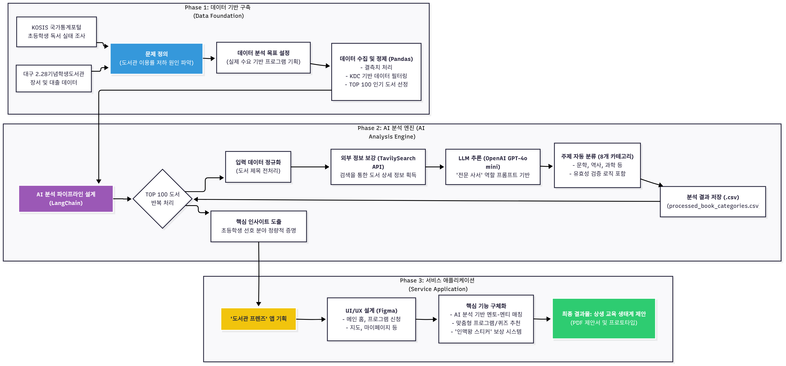
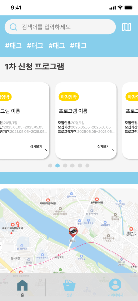
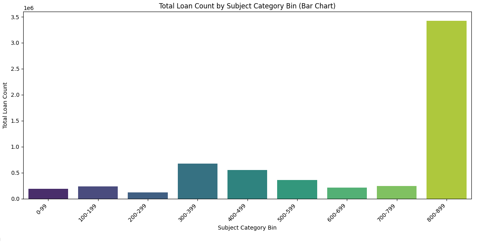

# Edu-Bridge-Library

데이터 분석 코드는 이 저장소에, 상세 분석 문서·스크린샷·프로젝트 회고는 Notion에 정리합니다.

## 🔗 Notion

  - **상세 문서**: [Edu-Bridge-Library 프로젝트](https://www.notion.so/Mentoring-Lab-27972d9f979f80788ea5dde9d89c5008?source=copy_link)

## 🚀 실행

이 프로젝트는 Python 데이터 분석 환경에서 실행하는 것을 권장합니다.

1.  이 저장소를 클론(clone)합니다.

    ```bash
    git clone https://github.com/jihun-moon/Edu-Bridge-Library.git
    ```

2.  프로젝트 폴더로 이동하여 필요한 라이브러리를 설치합니다. (예: pandas, matplotlib 등)

    ```bash
    pip install -r requirements.txt 
    ```

    *(requirements.txt 파일이 없는 경우, `notebooks/library_program_analysis.ipynb` 파일을 실행하는 데 필요한 라이브러리를 직접 설치해야 합니다.)*

3.  Jupyter Notebook을 실행하여 `notebooks/library_program_analysis.ipynb` 파일을 엽니다.

## 📂 폴더

  - **`data/`**: `daegu_2.28_lib_07.csv`와 같은 원본 및 가공된 데이터 세트가 위치합니다.
  - **`images/`**: `AI_Recommendation_System_Architecture.png`, `App_Main_Dashboard.png` 등 프로젝트 관련 이미지 및 시각화 자료가 위치합니다.
  - **`notebooks/`**: `library_program_analysis.ipynb` 등 데이터 분석을 위한 Jupyter Notebook 코드가 위치합니다.
  - **`report/`**: `library_program_proposal.pdf`와 같이 프로젝트 제안서 및 보고서가 위치합니다.

## 🖼️ 스크린샷

- **AI 추천 시스템 아키텍처**
  

- **메인 대시보드**

  

- **사용자 선호도 분석 그래프**
  

## 📄 라이선스

MIT
